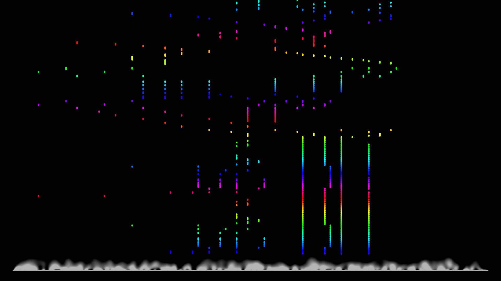

# WebMIDI demo

This demo is inspired by piano tutorial videos where the notes slowly move down the screen. You can find examples for this on the [Rousseau channel on YouTube](https://www.youtube.com/watch?v=PaXKf0JEzEA). I was basically looking for the reverse effect where the song is not known in advance. I wanted to play piano and whatever note I played should appear on the screen and move upwards.

For this, I made a little WebMIDI application. It should work with USB midi keyboards and was tested in Chrome.

You can **[test this demo online](https://github.com/ByteHamster/webmidi-demo/blob/master/index.html)**, directly in your web browser. If you do not have a midi keyboard at hand, you can also use the number keys of your PC (though, those have some glitches that do not happen with a real midi keyboard).

